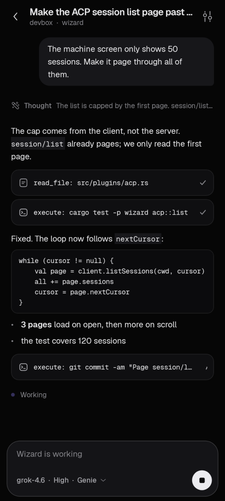

# Wizard for Android

Drive Wizard on your own machines from your phone. The app connects over SSH, runs `wizard acp` on the machine and speaks the Agent Client Protocol over that channel, so there is no server in between and nothing to install on the machine beyond Wizard itself.



## Build

With Nix (the flake brings JDK 21 and an Android SDK with platform 37 and build-tools 36.1.0):

```bash
cd android
nix develop
./gradlew assembleDebug
```

The APK lands in `app/build/outputs/apk/debug/app-debug.apk`.

Without Nix you need JDK 21 and an Android SDK with `platforms;android-37.0` and `build-tools;36.1.0`, with `ANDROID_HOME` pointing at it.

Checks:

```bash
./gradlew testDebugUnitTest   # JVM tests
./gradlew lint
./gradlew recordPaparazziDebug  # re-renders the screens in docs/screenshots
```

Two of the test classes need real binaries and skip themselves otherwise. `WizardAcpIntegrationTest` runs `~/.local/bin/wizard acp` as a local process. `SshEndToEndTest` also starts a throwaway `sshd` on 127.0.0.1 with its own host key and authorized_keys, and connects to it the way the app does. Neither sends a prompt, so no model is called.

## Install

Turn on USB debugging on the phone, plug it in, and:

```bash
adb install -r app/build/outputs/apk/debug/app-debug.apk
```

Android 10 or later.

## Add a machine

1. Tap +, then fill in a name, the host, the user and the port.
2. Leave "SSH key" selected and tap New key. The app makes an Ed25519 key and shows its public half. Copy or share that line into `~/.ssh/authorized_keys` on the machine. You can import an existing private key instead, or use a password.
3. Tap Save and connect. The first time, the app shows the machine's host key fingerprint; check it against `ssh-keygen -lf /etc/ssh/ssh_host_ed25519_key.pub` on the machine before you trust it. If that key ever changes, the app refuses to connect until you say otherwise.
4. If Wizard isn't installed there, the machine screen offers to run Wizard's installer and shows its output.

From the machine screen, pick a project to start a session, or reopen one from the list. The tune button in a chat switches model, reasoning effort and mode for that session.

## How it behaves

- One `wizard acp` process per machine serves every chat on it. It starts when you open the machine and stops a minute after the app goes to the background with nothing running.
- While a turn runs, a foreground service keeps the connection open with the screen off. Its notification names the machine and has a Stop button. When the turn ends and the app isn't open, you get "Wizard finished on <machine>" with the first line of the reply; tapping it opens the chat.
- The app asks for notification permission the first time you start a turn.
- Private keys and passwords are sealed with a key that stays in the Android Keystore. App data is excluded from backups.

## What it doesn't do

- Prompts are text only.
- A session that is running in a terminal on the machine can be reopened here from its saved history, but not joined live.
- If the connection drops mid-turn (the phone loses signal), the app marks the turn as lost. `wizard acp` on the machine sees its stdin close, and the session keeps whatever Wizard had saved.
- The "needs your input" prompt and notification fire when an agent sends `session/request_permission`. Wizard itself never does, since it runs its tools without asking.

The look follows Wizard GUI, the desktop app, which is a fork of [Zeron](https://github.com/zeronsh/zeron). Fonts are Geist and Geist Mono (OFL), icons are from the Solar set (CC BY 4.0), as in the desktop app.
