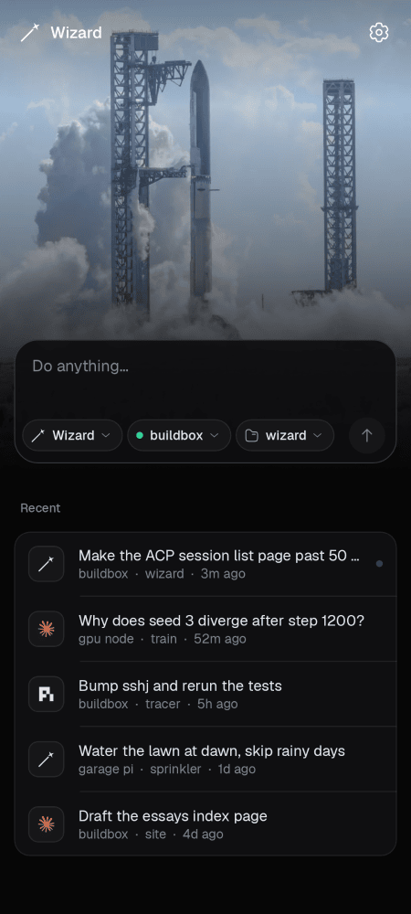

# Wizard for Android

Drive Wizard, Pi and Claude Code on your own machines from your phone. The app connects over SSH and talks to each agent the way Wizard GUI does: `wizard acp` and Pi's `pi-acp` adapter over the Agent Client Protocol, and Claude Code over its stream-json mode. There is no server in between.



## Build

With Nix (the flake brings JDK 21 and an Android SDK with platform 37 and build-tools 36.1.0):

```bash
cd android
nix develop
./gradlew assembleDebug
```

The APK lands in `app/build/outputs/apk/debug/app-debug.apk`.

Without Nix you need JDK 21 and an Android SDK with `platforms;android-37.0` and `build-tools;36.1.0`, with `ANDROID_HOME` pointing at it.

Checks:

```bash
./gradlew testDebugUnitTest   # JVM tests
./gradlew lint
./gradlew recordPaparazziDebug  # re-renders the screens in docs/screenshots
```

Some tests need real binaries and skip themselves otherwise. `AgentIntegrationTest` runs each installed agent through the app's own launch scripts in a local shell: Wizard and Pi through initialize, `session/new`, a config change and `session/list`, Claude Code through its `initialize` control request and its saved session logs. `SshEndToEndTest` starts a throwaway `sshd` on 127.0.0.1 and connects the way the app does. None of them sends a prompt, so no model is called. `ClaudeBackendTest` plays full turns against Wizard GUI's fake Claude CLI.

## Install

Turn on USB debugging on the phone, plug it in, and:

```bash
adb install -r app/build/outputs/apk/debug/app-debug.apk
```

Android 10 or later.

## Add a machine

The first launch walks through this; later, it's Settings, Machines, +.

1. Fill in the host, the user and the port.
2. Generate a key. The app makes an Ed25519 key and shows its public half. Copy or share that line into `~/.ssh/authorized_keys` on the machine. From Settings you can also import an existing private key, or use a password.
3. The first connection shows the machine's host key fingerprint; check it against `ssh-keygen -lf /etc/ssh/ssh_host_ed25519_key.pub` on the machine before you trust it. If that key ever changes, the app refuses to connect until you say otherwise.
4. If an agent isn't installed there, the agent chip and the machine screen offer to install it and show the installer's output. Wizard and Claude Code use their official install scripts. Pi gets its CLI, then the pinned `pi-acp` adapter in `~/.zeron/adapters`, the same place Wizard GUI puts it, which needs npm on the machine.

## Use it

The app opens on a new chat. Type and send. The chips under the message pick the agent, the machine and the folder, and remember the last choice. Below is one list of recent chats from every machine and agent, newest first. The tune button in a chat switches model and effort (and Wizard's mode) for that session.

Settings has the theme, compact mode (a turn's tool calls and thinking fold into one line) and the Starship artwork behind new Wizard chats, as on the desktop.

## How it behaves

- Per machine: one SSH connection, one ACP process each for Wizard and Pi serving all their chats, and one `claude -p` per Claude Code turn (`--session-id` on the first, `--resume` after). Claude Code's tool permissions are allowed without asking, as on the desktop; its questions come to you.
- Connections close a minute after the app goes to the background with nothing running.
- While a turn runs, a foreground service keeps the connection open with the screen off. Its notification names the machine and has a Stop button. When the turn ends and the app isn't open, you get "<agent> finished on <machine>" with the first line of the reply; tapping it opens the chat.
- Private keys and passwords are sealed with a key that stays in the Android Keystore. App data is excluded from backups.

## What it doesn't do

- Prompts are text only.
- A session that is running in a terminal on the machine can be reopened here from its saved history, but not joined live.
- If the connection drops mid-turn (the phone loses signal), the app marks the turn as lost. The agent on the machine sees its stdin close, and the session keeps whatever it had saved.
- Wizard never asks for permission over ACP, so "needs your input" only fires for Claude Code's questions and for an ACP agent that sends `session/request_permission`.

The look follows Wizard GUI, the desktop app, which is a fork of [Zeron](https://github.com/zeronsh/zeron). Fonts are Geist and Geist Mono (OFL), icons are from the Solar set (CC BY 4.0), as in the desktop app.
