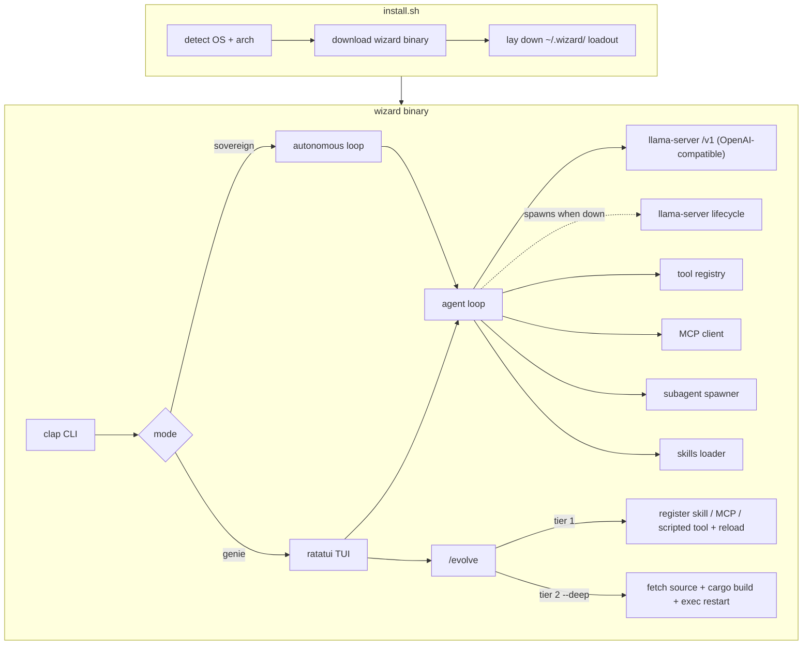

# Architecture

Wizard is a single-binary Rust application: a Ratatui front end on top of a provider-agnostic agent loop with an extensible tool set (native tools + MCP servers + scripted tools) and tiered self-extension. Providers are interchangeable: any OpenAI-compatible endpoint, Anthropic, Ollama, or a local llama.cpp server whose `llama-server` lifecycle Wizard manages itself.

## High-level overview



## Crate layout (planned)

```
wizard/
├── src/
│   ├── main.rs          # entry, terminal setup
│   ├── cli.rs           # argument parsing
│   ├── config.rs        # ~/.wizard/config.toml
│   ├── app.rs           # TUI state machine
│   ├── ui.rs            # ratatui rendering
│   ├── event.rs         # keyboard/mouse events
│   ├── agent/
│   │   ├── mod.rs       # tool-calling loop
│   │   ├── prompts.rs   # genie vs sovereign system prompts
│   │   ├── subagent.rs  # isolated sub-context spawner
│   │   └── session.rs   # JSONL session persistence
│   ├── server.rs        # llama-server lifecycle: spawn / health / stop
│   ├── llm/
│   │   ├── provider.rs  # LlmProvider trait
│   │   ├── llamacpp.rs  # llama-server client (default; wraps the OpenAI client)
│   │   ├── openai.rs    # OpenAI-compatible streaming client
│   │   ├── ollama.rs    # Ollama native /api/chat client
│   │   └── anthropic.rs # Anthropic client
│   ├── mcp/
│   │   └── mod.rs       # MCP client (stdio / HTTP tool servers)
│   ├── tools/
│   │   ├── file.rs      # read, write, edit, list, search
│   │   ├── shell.rs     # execute commands
│   │   ├── git.rs       # status, diff
│   │   └── registry.rs  # unified native + scripted + MCP tool registry
│   ├── evolve/
│   │   └── mod.rs       # tiered self-extension pipeline
│   └── skills/
│       └── mod.rs       # skills/*.md loader
├── skills/              # bundled skill definitions
├── loadout/             # canonical default loadout (mcp.toml, subagents/)
├── install.sh           # the one installer (default / local / BYOM / minimal flavors)
└── install-byom.sh      # back-compat shim: install.sh with WIZARD_BYOM=1
```

## Components

### CLI (`cli.rs`)

Parses arguments and selects run mode:

| Flag | Purpose |
|------|---------|
| `--mode genie\|sovereign` | Personality |
| `-p, --prompt` | Initial task (headless or pre-fill) |
| `--evolve` | Self-extension mode |
| `--max-hours` | Time limit (sovereign mode) |
| `--cwd` | Project root override |

### Config (`config.rs`)

Loaded from `~/.wizard/config.toml` with optional env overrides (`WIZARD_MODEL`, `WIZARD_LLAMACPP_HOST`, `WIZARD_GGUF_PATH`, `WIZARD_OLLAMA_HOST`):

```toml
active_provider = "local"
mode = "genie"
# 0 = no step limit: a turn runs until the model stops calling tools.
max_steps = 0

[[providers]]
name = "local"
kind = "llamacpp"
base_url = "http://127.0.0.1:11435"
model = "Qwen3.6-27B-Q4_K_M"
gguf_path = "/home/you/.wizard/models/Qwen3.6-27B-Q4_K_M.gguf"
```

When no `[[providers]]` are configured, Wizard synthesizes a local llama.cpp provider at `http://127.0.0.1:11435` (legacy `model` / `ollama_host`-only files included; Ollama is opt-in via an explicit `[[providers]]` entry).

At TUI startup, a missing or unstartable local backend isn't fatal. Wizard falls back in order: any configured cloud provider, then one synthesized from `ANTHROPIC_API_KEY` / `OPENAI_API_KEY`, then the interactive onboarding wizard. The fallback becomes the session's active provider in memory; only onboarding writes config to disk.

### LLM clients (`llm/`)

All providers implement the `LlmProvider` trait (health, model listing, streaming chat). The default, `llm/llamacpp.rs`, drives llama.cpp's `llama-server` through its OpenAI-compatible `/v1/chat/completions` endpoint (it composes the `llm/openai.rs` client rather than duplicating it) and probes the server's native `GET /health`:

- Streaming token delivery to the TUI
- Native tool-call round-trips, with a prompt-based JSON fallback when the model lacks native tool support
- Actionable errors when the server is down (`llama-server -m <model.gguf> --port 11435`)

`llm/ollama.rs` is a thin `reqwest` client over Ollama's native `/api/chat` endpoint (not the `/v1` shim; the native endpoint exposes Ollama's streaming and `tool_calls` fields directly), with its own health probe (`GET /api/tags`) and no `ollama-rs` dependency. `llm/anthropic.rs` covers the Anthropic API.

### llama-server lifecycle (`server.rs`)

When the active provider is llama.cpp and nothing answers at its `base_url`, Wizard starts `llama-server` itself, at TUI/headless/gateway startup and after `/provider use` switches to a llama.cpp provider. Requirements: the URL points at this machine, `llama-server` is on `PATH`, and the provider's `gguf_path` exists. The child is detached in its own process group (it survives Wizard's exit and Ctrl-C), logs to `~/.wizard/llama-server.log`, and its PID is recorded in `~/.wizard/llama-server.pid`. Readiness is polled at `GET /health` for up to 60 s (503 = model still loading). `/server status|start|stop` manages it from the TUI; `stop` verifies the recorded PID is still a `llama-server` before signalling, so a recycled PID can never kill an unrelated process.

### Agent loop (`agent/mod.rs`)

```
┌─────────────────────────────────────────┐
│  1. Build message list                  │
│     system prompt + skills + history    │
│  2. Stream completion from the provider │
│  3. Parse tool calls from response      │
│  4. Execute tools → append results        │
│  5. Repeat until the model is done      │
└─────────────────────────────────────────┘
```

A turn runs until the model stops calling tools. `max_steps = 0` (the default) puts no ceiling on that; a positive `max_steps` caps the round trips and ends the turn in `DoneReason::MaxSteps` when the budget is spent. Either way a turn is also bounded by a user interrupt or the sovereign loop-control file (`DoneReason::Stopped`), the `--max-hours` limit (`TimeLimit`), and the circuit breaker after repeated identical failures (`CircuitBreaker`).

Sessions are appended to `~/.wizard/sessions/<timestamp>.jsonl` after each turn.
Auto-compaction and the agent's own `/compact` (via `run_command`) shrink the
in-memory history while leaving the JSONL intact — prior conversation is always
recoverable from disk. See [Agent-managed context](usage.md#agent-managed-context).

### Images

Images move through the loop in both directions. A tool returns them on its `ToolOutput`
(`images: Vec<Image>`); a model generates them, and its provider emits them on the streaming
`ChatChunk` (`images` — the seam an image endpoint plugs into). Either way the agent takes
custody in one place, `agent::absorb_images`: it drops anything over the size cap, writes the
rest to `~/.wizard/images/<session>/<content-hash>.<ext>`, and announces them as
`AgentEvent::Images` — a path, a media type, a size, never base64.

The base64 stays on the `ChatMessage` in history, where a vision model needs it, and the path
is recorded next to it so a replayed transcript needs no re-derivation. A tool's images ride
back to the model on a *following user message*, not on the tool result: OpenAI's tool role
takes no image blocks, but a user message carries images on every provider.

### Tools (`tools/`)

| Tool | Description |
|------|-------------|
| `read_file` | Read file contents with optional line range |
| `write_file` | Create or overwrite a file |
| `edit_file` | Search-and-replace edit |
| `list_files` | Directory listing with glob filter |
| `search_files` | Ripgrep/grep content search |
| `execute` | Run shell command with timeout; `run_in_background` detaches it as a background task ([tasks.md](tasks.md)) |
| `git_status` | Working tree status |
| `git_diff` | Staged/unstaged diff |
| `web_fetch` | Fetch a URL, HTML converted to markdown; SSRF-guarded ([web.md](web.md)) |
| `web_search` | Web search via DuckDuckGo (default), Brave, Tavily, or xAI Grok ([web.md](web.md)) |
| `generate_image` | Generate an image via xAI Imagine (or any OpenAI-compatible images endpoint); saves under `generated/` ([image.md](image.md)) |
| `task_output` | Status and buffered output of a background task ([tasks.md](tasks.md)) |
| `task_kill` | Kill a running background task ([tasks.md](tasks.md)) |
| `run_command` | Run one of Wizard's own slash commands (e.g. `/effort high`, `/model`, `/compact`); dispatched by the TUI after the turn ([usage.md](usage.md#agent-run-slash-commands)) |

Neither mode has a per-action approval gate. Genie is conversational and interactive; sovereign works continuously without human input.

Beyond these built-ins, the registry also serves scripted tools (agent-authored scripts in `~/.wizard/tools/`, run through the `execute` sandbox; the Hermes `execute_code` analog) and MCP tools (see below). All three kinds present the same interface to the agent loop, so the model calls them identically.

### MCP client (`mcp/`)

Wizard speaks the Model Context Protocol as a client, so external capabilities plug in without recompiling the binary:

- Servers are declared in `~/.wizard/mcp.toml` (stdio or HTTP transport)
- On startup (and on `/reload`), Wizard lists each server's tools and merges them into the registry
- This is the supported path for computer use, browser control, database access, and any other capability shipped as an MCP server
- `/evolve` can register a new MCP server live (tier 1) without a rebuild

### Subagents (`agent/subagent.rs`)

The agent can spawn isolated subagents for parallel or decomposed work:

- Each subagent gets its own message history, step budget, and tool scope
- Results return to the parent as a single tool result, so a multi-step sub-task costs the parent one turn of context
- `spawn_subagent` can detach a run into the background: the parent keeps working (and the user keeps chatting) while the subagent runs, and its report lands in context when it finishes
- Every run emits `SubagentRun*` events keyed by a run id; the TUI demuxes them into one pane per run on the [subagent rail](usage.md#the-subagent-rail), headless surfaces print them inline as `<name> ▸ <tool>`
- Sovereign mode uses these to fan out across multi-file tasks; [fleet mode](fleet.md) coordinates parallel workers over git worktrees

### Skills (`skills/`)

Markdown files with frontmatter that get injected into the system prompt:

```
skills/
├── coding/SKILL.md     # general coding guidelines
└── evolve/SKILL.md     # self-extension instructions
```

Skills are loaded at startup and on `/reload`.

### Self-extension (`evolve/`)

Triggered by `/evolve` in the TUI or `--evolve` on the CLI. Self-extension is split into two tiers so it works on the prebuilt binary, not just dev installs. Full walkthrough in [evolve.md](evolve.md).

**Tier 1, runtime extension (default; no recompile).** Adds a skill, registers an MCP server, authors a scripted tool, or configures a subagent. Changes are written under `~/.wizard/` and activated by `/reload`. This covers most new capability (including computer use, via MCP) and works on every install.

**Tier 2, deep evolve (`/evolve --deep`; recompiles core).** For changes that require new Rust in the core:

1. Locate source (`~/.wizard/src`; cloned from the repo on first use)
2. Ensure a Rust toolchain (installed via `rustup` on first use if absent; see [Install scripts](#install-scripts))
3. Agent proposes a unified diff over its own source
4. `cargo build --release`
5. Replace the running process via `exec` (hot-reload)

If no toolchain or source is available and it can't be provisioned, deep evolve falls back to Tier 1 with a clear message. Evolution events are logged to `~/.wizard/evolution.jsonl`.

### TUI (`app.rs`, `ui.rs`, `event.rs`)

Ratatui + crossterm terminal UI:

- Chat panel with streaming markdown
- Tool invocation cards (collapsible)
- Git diff sidebar
- Subagent rail under the composer: one row per run, openable as a full chat view of that subagent's own transcript
- Status bar: model, mode, step count
- Command mode for `/slash` commands

## Data on disk

| Path | Contents |
|------|----------|
| `~/.wizard/config.toml` | User configuration |
| `~/.wizard/models/*.gguf` | Downloaded GGUF model files |
| `~/.wizard/llama.cpp/` | llama.cpp release tree installed by `install.sh` |
| `~/.wizard/llama-server.log` | Output of llama-servers Wizard spawned |
| `~/.wizard/llama-server.pid` | PID of the llama-server Wizard spawned |
| `~/.wizard/mcp.toml` | MCP server declarations (Playwright browser by default) |
| `~/.wizard/subagents/*.toml` | Subagent definitions (default roster: reviewer, researcher, tester, documenter) |
| `~/.wizard/tools/` | Agent-authored scripted tools |
| `~/.wizard/src/` | Source checkout for deep evolve (created on demand) |
| `~/.wizard/sessions/*.jsonl` | Chat history |
| `~/.wizard/images/<session>/` | Images produced in a session (tool output or model-generated), named by content hash |
| `~/.wizard/evolution.jsonl` | Self-extension log |
| `~/.wizard/sync/key` | Ed25519 signing-key seed for `wizard sync` (mode 0600; see [sync.md](sync.md)) |
| `~/.wizard/sync/trusted_keys` | Public keys `wizard sync pull` accepts, one per line, pinned on first use |
| `~/.wizard/sync/backups/` | Timestamped backups of files overwritten by `wizard sync pull` |
| `~/.wizard/logs/` | Debug traces |
| `.wizard/loop-control` | Sovereign-mode run control (per project) |
| `.wizard/checkpoints/` | Per-file edit snapshots powering `/rewind` (per project; see [checkpoints.md](checkpoints.md)) |

## Install scripts

### `install.sh` (the one installer)

By default it installs the binary and the [default loadout](loadout.md) (browser MCP + subagents, embedded as heredocs mirroring `loadout/`): no model, no config, no Rust toolchain. The first `wizard` run opens onboarding to pick a provider. Flavors: `WIZARD_LOCAL=1` preinstalls the local stack non-interactively (llama.cpp's `llama-server` from official ggml-org releases, a VRAM-tiered Qwen 3 GGUF, and `config.toml`; no server starts at install time, Wizard spawns it on first run), `WIZARD_USE_OLLAMA=1` is the Ollama variant of that flavor and implies it, `WIZARD_BYOM=1` sets up Ollama with a model of your choice, and `WIZARD_MINIMAL=1` installs the binary only (onboarding on first run; `WIZARD_BESPOKE=1` is a deprecated alias). The toolchain required for deep evolve (Tier 2) installs via `rustup --profile minimal` on the first `/evolve --deep` (~0.5–1 GB). Set `WIZARD_WITH_TOOLCHAIN=1` to install it at setup time instead (e.g. for air-gapped machines).

### `install-byom.sh` (back-compat shim)

Kept so the old BYOM one-liner URL still works: it downloads `install.sh` and runs it with `WIZARD_BYOM=1`. With the llama.cpp default, "bring your own model" usually just means pointing `gguf_path` at any GGUF; see [byom.md](byom.md).

## Dependencies

| Crate | Role |
|-------|------|
| `ratatui` + `crossterm` | Terminal UI |
| `tokio` | Async runtime |
| `reqwest` | Provider HTTP (llama-server, Ollama, cloud) |
| `clap` | CLI parsing |
| `serde` / `serde_json` | Serialization |
| `toml` + `dirs` | Config |
| `syntect` | Syntax highlighting in diffs |

Target release binary: **< 60 MB** (strip + LTO).

## Security model

- Inference goes to the active provider and nowhere else: a local server (llama.cpp or Ollama) with the local option, or the configured cloud API
- Beyond the active provider, the core makes outbound calls only for the things you invoke: the native web tools (`web_fetch` / `web_search`, [web.md](web.md)), the messaging gateway, the GGUF/model download during install, and deep evolve's source clone. MCP servers and scripted tools you add can make their own network and system calls; they run with your privileges, so only register ones you trust
- The `execute` tool runs real shell commands and cannot be confined to the working directory (absolute paths, `cd ..`, and pipes are all reachable). Treat tool execution as full local access, not a sandbox
- Both modes execute tool calls (writes, shell, git, and `/evolve` changes) directly: there is no approval gate. The modes differ in interactivity and continuity: genie is conversational; **sovereign works unattended and self-directs continuously**. Run either mode only on tasks and repos where unattended local command execution is acceptable
- Official Qwen 3.6 models retain their safety training

## Roadmap additions

Not yet built, in no particular order:

- Plugin marketplace (dynamic `.so` / WASM)
- `ollama launch wizard` (Ollama-native launcher integration)
- tree-sitter symbol search
- Remote subagent execution