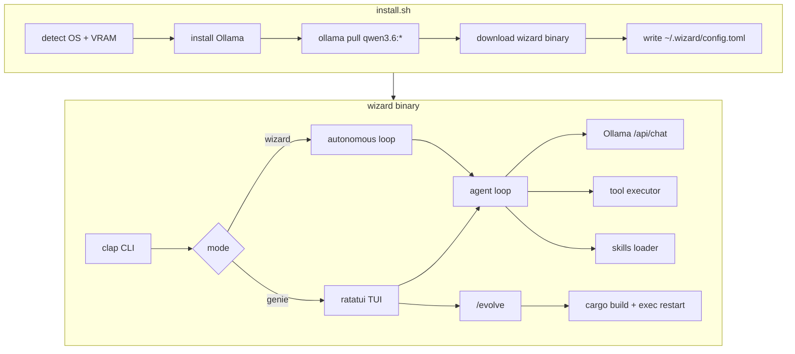

# Architecture

Wizard is a single-binary Rust application: a Ratatui front end on top of a local Ollama-backed agent loop with a fixed tool set and optional self-extension.

## High-level overview



## Crate layout (planned)

```
wizard/
├── src/
│   ├── main.rs          # entry, terminal setup
│   ├── cli.rs           # argument parsing
│   ├── config.rs        # ~/.wizard/config.toml
│   ├── app.rs           # TUI state machine
│   ├── ui.rs            # ratatui rendering
│   ├── event.rs         # keyboard/mouse events
│   ├── agent/
│   │   ├── mod.rs       # tool-calling loop
│   │   ├── prompts.rs   # genie vs wizard system prompts
│   │   └── session.rs   # JSONL session persistence
│   ├── llm/
│   │   └── ollama.rs    # streaming HTTP client
│   ├── tools/
│   │   ├── file.rs      # read, write, edit, list, search
│   │   ├── shell.rs     # execute commands
│   │   └── git.rs       # status, diff
│   ├── evolve/
│   │   └── mod.rs       # self-extension pipeline
│   └── skills/
│       └── mod.rs       # skills/*.md loader
├── skills/              # bundled skill definitions
├── install.sh           # official model one-liner
└── install-byom.sh      # bring-your-own-model installer
```

## Components

### CLI (`cli.rs`)

Parses arguments and selects run mode:

| Flag | Purpose |
|------|---------|
| `--mode genie\|wizard` | Personality |
| `-p, --prompt` | Initial task (headless or pre-fill) |
| `--evolve` | Self-extension mode |
| `--auto` | Skip confirmation prompts |
| `--max-hours` | Time limit (wizard mode) |
| `--cwd` | Project root override |

### Config (`config.rs`)

Loaded from `~/.wizard/config.toml` with optional env overrides:

```toml
model = "qwen3.6:27b"
ollama_host = "http://127.0.0.1:11434"
mode = "genie"
auto_approve = false
max_steps = 25
```

### LLM client (`llm/ollama.rs`)

Thin `reqwest` client over Ollama's OpenAI-compatible `/api/chat` endpoint:

- Streaming token delivery to the TUI
- Tool call request/response round-trips
- Health probe on startup (`GET /api/tags`)
- No `ollama-rs` dependency — keeps the binary small

### Agent loop (`agent/mod.rs`)

```
┌─────────────────────────────────────────┐
│  1. Build message list                  │
│     system prompt + skills + history    │
│  2. Stream completion from Ollama       │
│  3. Parse tool calls from response      │
│  4. Execute tools → append results        │
│  5. Repeat until done or max_steps      │
└─────────────────────────────────────────┘
```

Sessions are appended to `~/.wizard/sessions/<timestamp>.jsonl` after each turn.

### Tools (`tools/`)

| Tool | Description |
|------|-------------|
| `read_file` | Read file contents with optional line range |
| `write_file` | Create or overwrite a file |
| `edit_file` | Search-and-replace edit |
| `list_files` | Directory listing with glob filter |
| `search_files` | Ripgrep/grep content search |
| `execute` | Run shell command with timeout |
| `git_status` | Working tree status |
| `git_diff` | Staged/unstaged diff |

Genie mode gates write/shell/git tools behind user confirmation. Wizard mode auto-approves.

### Skills (`skills/`)

Markdown files with frontmatter that get injected into the system prompt:

```
skills/
├── coding/SKILL.md     # general coding guidelines
└── evolve/SKILL.md     # self-extension instructions
```

Skills are loaded at startup and on `/reload`.

### Self-extension (`evolve/`)

Triggered by `/evolve` in the TUI or `--evolve` on the CLI:

1. Agent reads its own source tree (`WIZARD_SRC` or compile-time path)
2. Proposes a unified diff
3. User approves (unless `--auto`)
4. Applies patch
5. Runs `cargo build --release`
6. Replaces running process via `exec` (hot-reload)

Evolution events are logged to `~/.wizard/evolution.jsonl`.

### TUI (`app.rs`, `ui.rs`, `event.rs`)

Ratatui + crossterm terminal UI:

- Chat panel with streaming markdown
- Tool invocation cards (collapsible)
- Git diff sidebar
- Status bar: model, mode, step count
- Command mode for `/slash` commands

## Data on disk

| Path | Contents |
|------|----------|
| `~/.wizard/config.toml` | User configuration |
| `~/.wizard/sessions/*.jsonl` | Chat history |
| `~/.wizard/evolution.jsonl` | Self-extension log |
| `~/.wizard/logs/` | Debug traces |
| `.wizard/loop-control` | Wizard-mode run control (per project) |

## Install scripts

### `install.sh` (default)

Official models only. VRAM-aware tier selection. No custom Modelfiles.

### `install-byom.sh` (optional)

Same binary install, but user selects any Ollama model. See [byom.md](byom.md).

## Dependencies

| Crate | Role |
|-------|------|
| `ratatui` + `crossterm` | Terminal UI |
| `tokio` | Async runtime |
| `reqwest` | Ollama HTTP |
| `clap` | CLI parsing |
| `serde` / `serde_json` | Serialization |
| `toml` + `dirs` | Config |
| `syntect` | Syntax highlighting in diffs |

Target release binary: **< 60 MB** (strip + LTO).

## Security model

- All inference is local via Ollama
- No outbound API calls in v0.1 (except `ollama pull` during install)
- Tool execution is confined to the project working directory
- Genie mode requires explicit approval for writes and shell commands
- Official Qwen 3.6 models retain their safety training

## Roadmap additions

| Version | Architecture change |
|---------|-------------------|
| v0.2 | Plugin system (dynamic `.so` / WASM modules), multi-agent coordinator |
| v0.3 | `ollama launch wizard` — Ollama-native launcher integration |
| Future | tree-sitter symbol search, MCP tool servers, tmux background tasks |