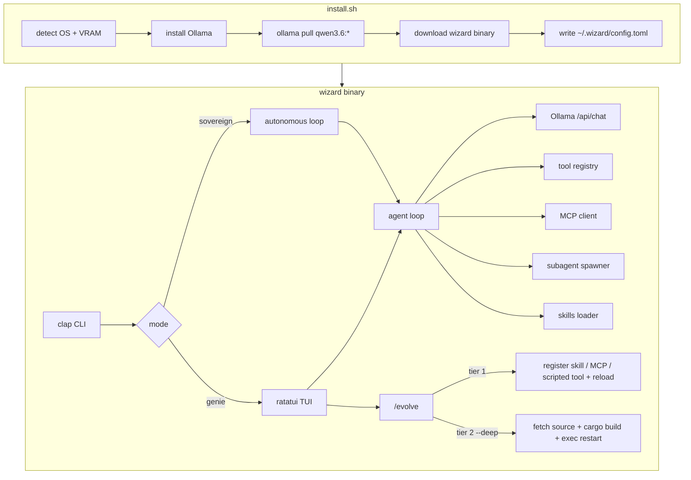

# Architecture

Wizard is a single-binary Rust application: a Ratatui front end on top of a local Ollama-backed agent loop with an extensible tool set (native tools + MCP servers + scripted tools) and tiered self-extension.

## High-level overview



## Crate layout (planned)

```
wizard/
├── src/
│   ├── main.rs          # entry, terminal setup
│   ├── cli.rs           # argument parsing
│   ├── config.rs        # ~/.wizard/config.toml
│   ├── app.rs           # TUI state machine
│   ├── ui.rs            # ratatui rendering
│   ├── event.rs         # keyboard/mouse events
│   ├── agent/
│   │   ├── mod.rs       # tool-calling loop
│   │   ├── prompts.rs   # genie vs sovereign system prompts
│   │   ├── subagent.rs  # isolated sub-context spawner
│   │   └── session.rs   # JSONL session persistence
│   ├── llm/
│   │   └── ollama.rs    # streaming HTTP client
│   ├── mcp/
│   │   └── mod.rs       # MCP client (stdio / HTTP tool servers)
│   ├── tools/
│   │   ├── file.rs      # read, write, edit, list, search
│   │   ├── shell.rs     # execute commands
│   │   ├── git.rs       # status, diff
│   │   └── registry.rs  # unified native + scripted + MCP tool registry
│   ├── evolve/
│   │   └── mod.rs       # tiered self-extension pipeline
│   └── skills/
│       └── mod.rs       # skills/*.md loader
├── skills/              # bundled skill definitions
├── install.sh           # official model one-liner
└── install-byom.sh      # bring-your-own-model installer
```

## Components

### CLI (`cli.rs`)

Parses arguments and selects run mode:

| Flag | Purpose |
|------|---------|
| `--mode genie\|sovereign` | Personality |
| `-p, --prompt` | Initial task (headless or pre-fill) |
| `--evolve` | Self-extension mode |
| `--auto` | Skip confirmation prompts |
| `--max-hours` | Time limit (sovereign mode) |
| `--cwd` | Project root override |

### Config (`config.rs`)

Loaded from `~/.wizard/config.toml` with optional env overrides:

```toml
model = "qwen3.6:27b"
ollama_host = "http://127.0.0.1:11434"
mode = "genie"
auto_approve = false
max_steps = 25
```

### LLM client (`llm/ollama.rs`)

Thin `reqwest` client over Ollama's native `/api/chat` endpoint (not the OpenAI-compatible `/v1/chat/completions` shim — the native endpoint exposes Ollama's streaming and `tool_calls` fields directly):

- Streaming token delivery to the TUI
- Native tool-call round-trips, with a prompt-based JSON fallback when the model lacks native tool support
- Health probe on startup (`GET /api/tags`)
- No `ollama-rs` dependency — keeps the binary small

### Agent loop (`agent/mod.rs`)

```
┌─────────────────────────────────────────┐
│  1. Build message list                  │
│     system prompt + skills + history    │
│  2. Stream completion from Ollama       │
│  3. Parse tool calls from response      │
│  4. Execute tools → append results        │
│  5. Repeat until done or max_steps      │
└─────────────────────────────────────────┘
```

Sessions are appended to `~/.wizard/sessions/<timestamp>.jsonl` after each turn.

### Tools (`tools/`)

| Tool | Description |
|------|-------------|
| `read_file` | Read file contents with optional line range |
| `write_file` | Create or overwrite a file |
| `edit_file` | Search-and-replace edit |
| `list_files` | Directory listing with glob filter |
| `search_files` | Ripgrep/grep content search |
| `execute` | Run shell command with timeout |
| `git_status` | Working tree status |
| `git_diff` | Staged/unstaged diff |

Genie mode gates write/shell/git tools behind user confirmation. Sovereign mode auto-approves.

Beyond these built-ins, the registry also serves **scripted tools** (agent-authored scripts in `~/.wizard/tools/`, run through the `execute` sandbox — the Hermes `execute_code` analog) and **MCP tools** (see below). All three kinds present a uniform interface to the agent loop, so the model calls them identically.

### MCP client (`mcp/`)

Wizard speaks the Model Context Protocol as a client, so external capabilities plug in without recompiling the binary:

- Servers are declared in `~/.wizard/mcp.toml` (stdio or HTTP transport)
- On startup (and on `/reload`), Wizard lists each server's tools and merges them into the registry
- This is the supported path for **computer use**, browser control, database access, and any other capability shipped as an MCP server
- `/evolve` can register a new MCP server live (tier 1) — no rebuild required

### Subagents (`agent/subagent.rs`)

The agent can spawn isolated subagents for parallel or decomposed work:

- Each subagent gets its own message history, step budget, and tool scope
- Results return to the parent as a single tool result, so a multi-step sub-task costs the parent one turn of context
- Sovereign mode uses these to fan out across multi-file tasks; v0.2 expands them into coordinated swarms

### Skills (`skills/`)

Markdown files with frontmatter that get injected into the system prompt:

```
skills/
├── coding/SKILL.md     # general coding guidelines
└── evolve/SKILL.md     # self-extension instructions
```

Skills are loaded at startup and on `/reload`.

### Self-extension (`evolve/`)

Triggered by `/evolve` in the TUI or `--evolve` on the CLI. Modeled on how Hermes and Pi extend themselves, Wizard splits self-extension into two tiers so it works on the prebuilt binary, not just dev installs. Full walkthrough in [evolve.md](evolve.md).

**Tier 1 — runtime extension (default; no recompile).** `/evolve` can add a skill, register an MCP server, author a scripted tool, or configure a subagent. Changes are written under `~/.wizard/` and activated by `/reload` — live, Pi-style, but on data/config rather than core source. This is how most new capability (including computer use, via MCP) is added, and it works on every install.

**Tier 2 — deep evolve (`/evolve --deep`; recompiles core).** For changes that genuinely require new Rust:

1. Locate source (`~/.wizard/src`; cloned from the repo on first use)
2. Ensure a Rust toolchain — installed just-in-time via `rustup --profile minimal` if absent (~0.5–1 GB, only on the first deep evolve)
3. Agent proposes a unified diff over its own source
4. User approves (unless `--auto`)
5. `cargo build --release`
6. Replace the running process via `exec` (hot-reload)

If no toolchain or source is available and it can't be provisioned, deep evolve falls back to Tier 1 with a clear message. Evolution events are logged to `~/.wizard/evolution.jsonl`.

### TUI (`app.rs`, `ui.rs`, `event.rs`)

Ratatui + crossterm terminal UI:

- Chat panel with streaming markdown
- Tool invocation cards (collapsible)
- Git diff sidebar
- Status bar: model, mode, step count
- Command mode for `/slash` commands

## Data on disk

| Path | Contents |
|------|----------|
| `~/.wizard/config.toml` | User configuration |
| `~/.wizard/mcp.toml` | MCP server declarations |
| `~/.wizard/tools/` | Agent-authored scripted tools |
| `~/.wizard/src/` | Source checkout for deep evolve (created on demand) |
| `~/.wizard/sessions/*.jsonl` | Chat history |
| `~/.wizard/evolution.jsonl` | Self-extension log |
| `~/.wizard/logs/` | Debug traces |
| `.wizard/loop-control` | Sovereign-mode run control (per project) |

## Install scripts

### `install.sh` (default)

Official models only. VRAM-aware tier selection. No custom Modelfiles. Installs the binary, Ollama, and the model — **no Rust toolchain**, keeping the default footprint lean (the binary plus Ollama and the model, which dominates disk). The toolchain required for deep evolve (Tier 2) is installed just-in-time on the first `/evolve --deep`. Set `WIZARD_WITH_TOOLCHAIN=1` to install it eagerly at setup time (e.g. for air-gapped machines).

### `install-byom.sh` (optional)

Same binary install, but user selects any Ollama model. See [byom.md](byom.md).

## Dependencies

| Crate | Role |
|-------|------|
| `ratatui` + `crossterm` | Terminal UI |
| `tokio` | Async runtime |
| `reqwest` | Ollama HTTP |
| `clap` | CLI parsing |
| `serde` / `serde_json` | Serialization |
| `toml` + `dirs` | Config |
| `syntect` | Syntax highlighting in diffs |

Target release binary: **< 60 MB** (strip + LTO).

## Security model

- All inference is local via Ollama; no model data leaves the machine
- No outbound API calls from the core loop in v0.1 (except `ollama pull` during install). **Note:** MCP servers and scripted tools you add can make their own network and system calls — they run with your privileges, so only register ones you trust
- The `execute` tool runs real shell commands and **cannot be confined to the working directory** (absolute paths, `cd ..`, and pipes are all reachable). Treat tool execution as full local access, not a sandbox
- **Genie mode** gates writes, shell, and git behind explicit approval. **Sovereign mode auto-approves all model-generated tool calls** — including shell and `/evolve` changes. This is the primary risk surface: run sovereign mode only on tasks and repos where unattended local command execution is acceptable
- Official Qwen 3.6 models retain their safety training

## Roadmap additions

| Version | Architecture change |
|---------|-------------------|
| v0.2 | Subagent swarms, deep `/evolve` source rebuild, plugin marketplace (dynamic `.so` / WASM) |
| v0.3 | `ollama launch wizard` — Ollama-native launcher integration |
| Future | tree-sitter symbol search, tmux background tasks, remote subagent execution |